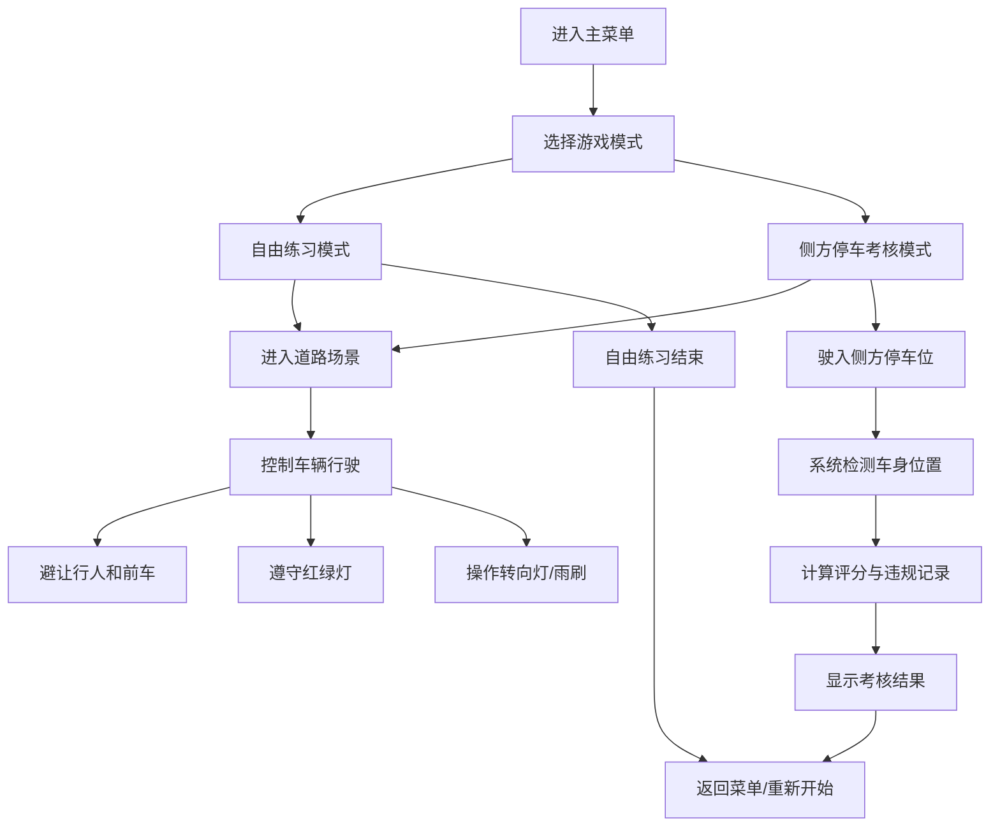

## 1. 产品概述

新手驾驶模拟器 - 无需真车上路即可练习车感的 2D 俯视视角驾驶训练游戏，帮助新手熟悉基本驾驶操作。

- 主要用途：为驾驶新手提供安全的虚拟练车环境，练习油门、刹车、转向、转向灯等基本操作
- 目标用户：准备学车或刚学车的新手驾驶员
- 产品价值：降低练车成本，提高安全性，随时随地练习基础驾驶技能

## 2. 核心功能

### 2.2 功能模块

1. **游戏主界面**：开始菜单、操作说明、模式选择
2. **道路行驶场景**：俯视视角 2D 道路，车辆物理模拟
3. **交通系统**：红绿灯、斑马线行人、前方慢车随机生成
4. **车辆控制系统**：加速、刹车、左右转向、转向灯、雨刷
5. **侧方停车考核**：指定车位停车检测、车身出线检测、评分系统
6. **违规扣分系统**：闯红灯、撞车、压线等违规行为检测与扣分
7. **仪表盘 UI**：实时显示车速、转向灯状态、雨刷状态、得分、剩余时间

### 2.3 页面详情

| 页面名称 | 模块名称 | 功能描述 |
|---------|---------|---------|
| 主菜单页 | 标题区 | 游戏标题、开始按钮、操作说明按钮 |
| 主菜单页 | 模式选择 | 自由练习模式 / 侧方停车考核模式 |
| 游戏主页面 | 游戏画布 | Canvas 2D 渲染俯视视角道路场景 |
| 游戏主页面 | 仪表盘 | 车速表、转向灯指示、雨刷状态、得分显示 |
| 游戏主页面 | 控制面板 | 虚拟方向盘、油门、刹车踏板（键盘操作） |
| 考核结果页 | 成绩展示 | 得分、违规记录、停车精度分析 |

## 3. 核心流程

用户进入游戏 → 选择模式（自由练习/侧方停车考核）→ 进入游戏场景 → 控制车辆行驶（注意红绿灯、避让行人与前车）→ 完成侧方停车（考核模式）→ 系统检测并评分 → 显示结果，可选择重新开始或返回菜单

## 4. 用户界面设计

### 4.1 设计风格

- **主色调**：深蓝夜色主题（#0a1628）配合荧光绿（#00ff88）作为高亮色，营造夜间驾驶氛围
- **辅助色**：交通信号红（#ff3b30）、信号黄（#ffcc00）、信号绿（#34c759）
- **按钮风格**：圆角矩形，轻微 3D 凸起效果，悬停有荧光边框
- **字体**：主标题使用 Orbitron（科技感字体），正文使用 JetBrains Mono（等宽字体，仪表盘风格）
- **布局风格**：游戏画布居中，仪表盘悬浮于画布上方边缘，控制面板在底部
- **图标风格**：简约线性图标，使用霓虹发光效果

### 4.2 页面设计概述

| 页面名称 | 模块名称 | UI 元素 |
|---------|---------|---------|
| 主菜单页 | 标题区 | 大标题发光动画，渐变背景，霓虹边框装饰 |
| 主菜单页 | 模式选择 | 卡片式按钮，悬停上浮效果，图标加文字 |
| 游戏主页面 | 游戏画布 | 深色沥青路面，黄色虚线车道线，绿色草地边缘 |
| 游戏主页面 | 仪表盘 | 半圆形车速表，左右转向灯闪烁指示，雨刷状态图标 |
| 游戏主页面 | 得分面板 | 右上角显示当前得分、违规次数、考核时间 |
| 考核结果页 | 成绩展示 | 大字号分数，星级评价，违规明细列表 |

### 4.3 响应性

- 桌面端优先设计，画布尺寸固定为 900x600px
- 键盘操作：W/↑ 加速，S/↓ 刹车，A/← 左转，D/→ 右转，Q/E 左右转向灯，R 雨刷，空格手刹
- 窗口自适应居中布局，保持游戏画布比例

### 4.4 2D 场景设计

- **环境**：俯视视角城市道路，双向两车道，两侧有草地和人行道
- **视觉元素**：
  - 路面：深灰色沥青质感，带有细微颗粒纹理
  - 车道线：黄色虚线，边缘白色实线
  - 车辆：玩家车辆为蓝色，前车为灰色，行人用小圆点表示
  - 红绿灯：路口顶部悬挂，红黄绿三色圆形灯
  - 停车位：白色虚线框，带有编号
- **动画效果**：
  - 车辆行驶时有轻微上下颠簸
  - 转向灯闪烁动画
  - 雨刷摆动动画
  - 刹车时尾灯亮起
  - 违规时有红色边框闪烁提示
