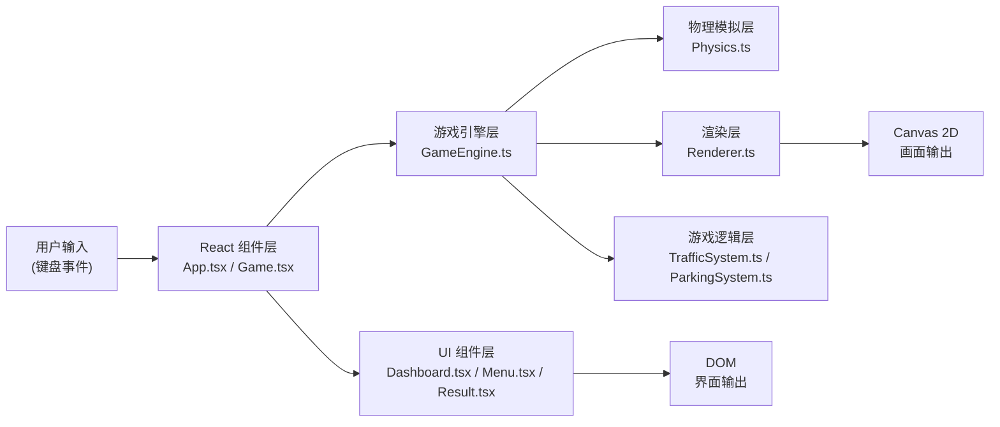

## 1. 架构设计



## 2. 技术描述

- **前端框架**：React@18 + TypeScript + Vite@5
- **样式方案**：TailwindCSS@3
- **游戏渲染**：HTML5 Canvas 2D API
- **状态管理**：React useState + useRef（游戏状态用 ref 避免重渲染）
- **动画循环**：requestAnimationFrame
- **初始化工具**：npm create vite@latest
- **后端**：无（纯前端游戏）
- **数据库**：无（使用 localStorage 保存最高分）

### 技术选型说明

1. **Canvas 2D**：适合 2D 俯视视角游戏渲染，性能优秀，API 简洁
2. **React + TypeScript**：组件化开发 UI，类型安全，便于维护
3. **TailwindCSS**：快速构建 UI 样式，支持深色主题
4. **Vite**：开发体验好，热更新快，构建效率高

## 3. 目录结构

```
src/
├── components/
│   ├── Game.tsx           # 游戏主组件
│   ├── Menu.tsx           # 主菜单组件
│   ├── Dashboard.tsx      # 仪表盘 UI 组件
│   ├── Result.tsx         # 考核结果组件
│   └── Controls.tsx       # 操作说明组件
├── game/
│   ├── GameEngine.ts      # 游戏引擎核心
│   ├── Physics.ts         # 物理模拟（车辆运动、碰撞检测）
│   ├── Renderer.ts        # Canvas 渲染器
│   ├── TrafficSystem.ts   # 交通系统（红绿灯、行人、前车）
│   ├── ParkingSystem.ts   # 侧方停车检测与评分
│   └── types.ts           # 类型定义
├── hooks/
│   └── useGameLoop.ts     # 游戏循环 Hook
├── App.tsx
├── main.tsx
└── index.css
```

## 4. 路由定义

| 路由 | 用途 |
|-----|------|
| / | 主菜单页面 |
| /game | 游戏主页面（包含自由练习和考核模式） |

*使用 React Router v6 进行路由管理*

## 5. 核心数据结构

### 5.1 车辆状态

```typescript
interface CarState {
  x: number;           // X 坐标
  y: number;           // Y 坐标
  angle: number;       // 朝向角度（弧度）
  speed: number;       // 当前速度（像素/帧）
  maxSpeed: number;    // 最大速度
  acceleration: number;// 加速度
  brakeForce: number;  // 刹车力度
  friction: number;    // 摩擦系数
  width: number;       // 车宽
  height: number;      // 车长
  leftSignal: boolean; // 左转向灯状态
  rightSignal: boolean;// 右转向灯状态
  wiperLevel: number;  // 雨刷档位 0-2
  brakeLight: boolean; // 刹车灯状态
}
```

### 5.2 游戏状态

```typescript
interface GameState {
  mode: 'menu' | 'practice' | 'exam';
  score: number;
  violations: Violation[];
  isPaused: boolean;
  isGameOver: boolean;
  timeElapsed: number;
  parkingState: ParkingState;
}

interface Violation {
  type: 'red_light' | 'collision' | 'speeding' | 'lane_violation' | 'no_signal';
  message: string;
  points: number;
  timestamp: number;
}
```

### 5.3 交通元素

```typescript
interface TrafficLight {
  x: number;
  y: number;
  state: 'red' | 'yellow' | 'green';
  timer: number;
}

interface Pedestrian {
  x: number;
  y: number;
  speed: number;
  direction: number;
  onCrosswalk: boolean;
}

interface NPCVehicle {
  x: number;
  y: number;
  angle: number;
  speed: number;
  maxSpeed: number;
}

interface ParkingSpot {
  x: number;
  y: number;
  width: number;
  height: number;
  angle: number;
  isOccupied: boolean;
}
```

### 5.4 停车评分

```typescript
interface ParkingResult {
  isParked: boolean;
  isInBounds: boolean;      // 是否完全在车位内
  overhangDistance: number; // 出线距离
  angleDeviation: number;   // 角度偏差（度）
  centerOffset: number;     // 距离中心偏移
  timeTaken: number;        // 用时
  score: number;
  stars: 1 | 2 | 3;
}
```

## 6. 核心算法

### 6.1 车辆物理模拟

```
每帧更新：
1. 根据输入更新加速度和转向角
2. speed += acceleration * deltaTime
3. speed *= friction（自然减速）
4. 限制 speed 在 -maxSpeed 到 maxSpeed 之间
5. 转向角速度 = speed * turnRate * sign(speed)
6. angle += steeringAngle * deltaTime
7. x += cos(angle) * speed * deltaTime
8. y += sin(angle) * speed * deltaTime
```

### 6.2 碰撞检测

- **矩形碰撞检测**：使用 SAT（分离轴定理）检测旋转矩形之间的碰撞
- **边界检测**：检测车辆是否超出道路边界
- **停车位检测**：检测车辆四个角是否都在停车位矩形内

### 6.3 侧方停车评分算法

```
总分 100 分：
- 完全在车位内：40 分
- 角度偏差 < 5°：20 分，5-15°：10 分，>15°：0 分
- 中心偏移 < 10px：20 分，10-30px：10 分，>30px：0 分
- 时间 < 30s：20 分，30-60s：10 分，>60s：0 分
- 违规扣分：每次违规扣 5-20 分

星级评定：
- 90-100 分：★★★
- 70-89 分：★★
- 60-69 分：★
- <60 分：不合格
```

## 7. 键盘映射

| 按键 | 功能 |
|-----|------|
| W / ↑ | 加速 |
| S / ↓ | 刹车 / 倒车 |
| A / ← | 左转 |
| D / → | 右转 |
| Q | 左转向灯（切换） |
| E | 右转向灯（切换） |
| R | 雨刷（0→1→2→0 循环） |
| 空格 | 手刹 |
| Esc | 暂停 / 返回菜单 |
| Enter | 开始 / 确认 |
```
